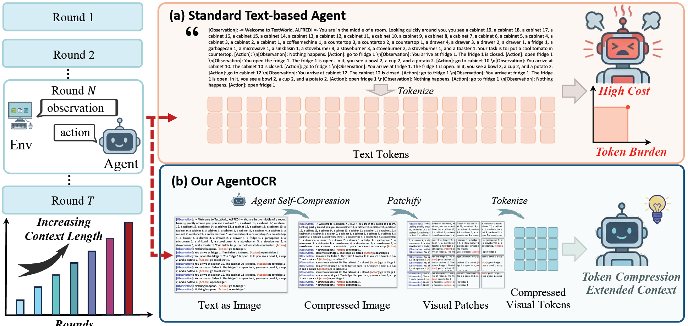

<h3 align="center">
<b>AgentOCR: Reimagining Agent History via Optical Self-Compression</b>
</h3>


<p align="center">
  <a href="#">
    </a>
  &nbsp;
  <a href="https://github.com/langfengQ/AgentOCR">
    </a>
</p>

AgentOCR addresses the critical bottleneck of rapidly growing textual histories in multi-turn LLM agent training by representing observation-action history as **compact rendered images**. This approach exploits the superior information density of visual tokens, substantially reducing token consumption while preserving agent performance.

<p align="center">
    
</p>

**Key Features:**
- **Visual Token Representation**: Renders history as compact images, achieving >50% token reduction with >95% performance preservation
- **Segment Optical Caching**: Hashable segment decomposition with visual cache enables 20× rendering speedup
- **Agentic Self-Compression**: Agent learns to adaptively emit compression rates via compression-aware reward training


# Installation
## Install veRL
```bash
conda create -n AgentOCR python==3.12 -y
conda activate AgentOCR

pip3 install vllm==0.11.0

pip3 install flash-attn==2.7.4.post1 --no-build-isolation --no-cache-dir
pip install -e .
```

## Install Supported Environments

### 1. ALFWorld
Install with pip:
```bash
pip3 install gymnasium==0.29.1
pip3 install stable-baselines3==2.6.0
pip install alfworld
```

Download PDDL & Game files and pre-trained MaskRCNN detector (will be stored in `~/.cache/alfworld/`):
```bash
alfworld-download -f
```

### 2. Search
```bash
cd ./agent_system/environments/env_package/search/third_party
pip install -e .
pip install gym==0.26.2
```

Prepare dataset (data will be saved at `~/data/searchR1_processed_direct`):
```bash
cd repo_root/
python examples/data_preprocess/preprocess_search_r1_dataset.py
```


Since faiss-gpu is not available via pip, we setup a separate conda environment for the local retrieval server. Running this server will use around 6GB of GPU memory per GPU, so make sure to account for this in your training run configuration. Build Retriever environments:
```bash
# Create and activate the retriever environment with Python 3.10
conda create -n retriever python=3.10 -y
conda activate retriever

# Install PyTorch (with GPU support) and related libraries
conda install numpy==1.26.4 # needed to stop incompatible version of numpy from being installed via pip
pip install torch==2.6.0 torchvision==0.21.0 torchaudio==2.6.0 --index-url https://download.pytorch.org/whl/cu124

# Install other Python packages
pip install transformers datasets pyserini huggingface_hub

# Install the GPU version of faiss
conda install faiss-gpu==1.8.0 -c pytorch -c nvidia -y

# Install the API service framework
pip install uvicorn fastapi
```

Download the index:
```bash
conda activate retriever

local_dir=~/data/searchR1
python examples/search/searchr1_download.py --local_dir $local_dir
cat $local_dir/part_* > $local_dir/e5_Flat.index
gzip -d $local_dir/wiki-18.jsonl.gz
```

Start the local flat e5 retrieval server: 
```bash
conda activate retriever

# redirect the output to a file to avoid cluttering the terminal
# we have observed outputting to the terminal causing spikes in server response times
bash examples/search/retriever/retrieval_launch.sh > retrieval_server.log 
```

# Run Examples

We provide training scripts for ALFWorld and Search-based QA tasks:

```bash
# ALFWorld
bash examples/agentocr_trainer/run_alfworld.sh

# Search
bash examples/agentocr_trainer/run_search.sh
```

# Acknowledgement

AgentOCR is built upon [verl-agent](https://github.com/langfengQ/verl-agent) and [veRL](https://github.com/volcengine/verl), which provide the foundational infrastructure for multi-turn agent training and efficient RL training for LLMs. 

The supported environments are adapted from [ALFWorld](https://github.com/alfworld/alfworld) for embodied AI tasks and [Search-R1](https://github.com/PeterGriffinJin/Search-R1) for search-based question answering. We extend our gratitude to the authors and contributors of these projects for their valuable work.
